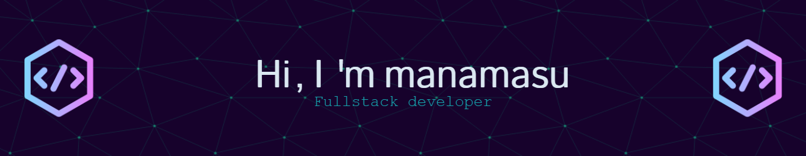

--- 

<h2> 👨‍💻⚡&nbsp;A little bit about me and my interests ⚡👨‍💻</h2>

```yaml
education:
  [
   "Bachelor's degree in Bussiness Information Systems"
  ]

fields_of_interests:
  [
    "Fullstack Development",
    "Data Science",
    "Machine Learning",
    "Game Development",
  ]
technical_background:
  [
    Working student as "Frontend Web Developer"
  ]
  
currently_learning: ["Docker", "Node.js", "C#", "Golang", "Data Science"]
hobbies: ["Sports", "Art", "Learning", "Chess"]
```


--- 

<h2> 🚀 &nbsp;Programming languages and Frameworks I use</h2>
<p align="left">

 


 


</p>

<!--
**manamasu/manamasu** is a ✨ _special_ ✨ repository because its `README.md` (this file) appears on your GitHub profile.

Here are some ideas to get you started:

- 🔭 I’m currently working on ...
- 🌱 I’m currently learning ...
- 👯 I’m looking to collaborate on ...
- 🤔 I’m looking for help with ...
- 💬 Ask me about ...
- 📫 How to reach me: ...
- 😄 Pronouns: ...
- ⚡ Fun fact: ...
-->
